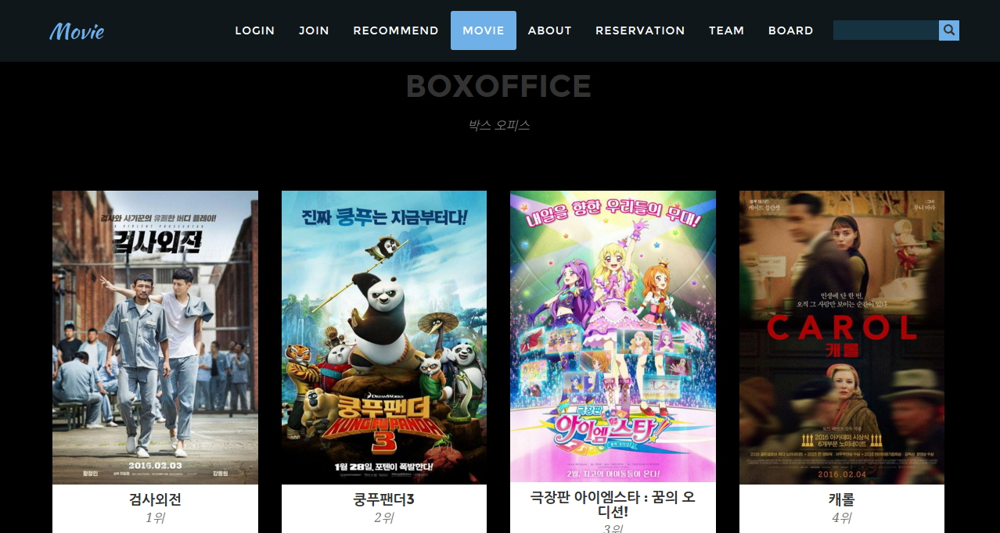
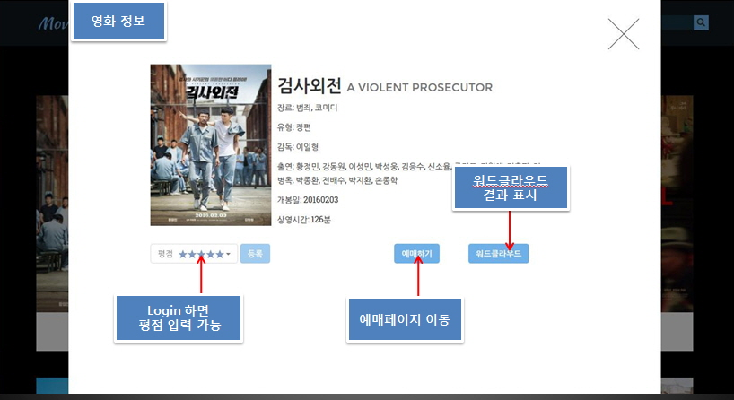
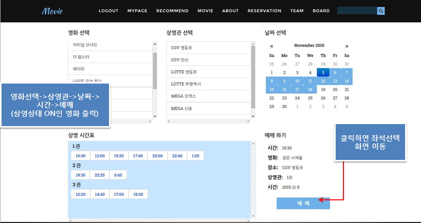
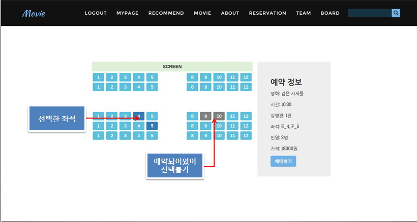

# 프로젝트명: 영화 예매 및 추천 웹

- 기간: 2015. 11. ~ 2016. 01.
- 개발환경: 
   - 인원: 4명
   - 개발도구: Eclipse, Apache Tomcat, Jdk 1.8.0, Oracle 10g
- 주요기술: Java, Jquery, Spring(jdbc, mvc), Jsp, Oracle, Bootstrap
- 기타(사진,링크 등) 

### 앱 작동 화면

<table width="80%">
   <tr>
      <td align="middle">
<figure>
    
    <figcaption>초기화면</figcaption>
</figure>
      </td>
   </tr>
   <tr>
      <td align="middle">
<figure>
    
    <figcaption>회원가입</figcaption>
</figure>
      </td>
   </tr>
   <tr>
      <td align="middle">
<figure>
    
    <figcaption>사업자 등록</figcaption>
</figure>
      </td>
   </tr>
   <tr>
      <td align="middle">
<figure>
    
    <figcaption>사업자 메인</figcaption>
</figure>
      </td>
   </tr>
</table>
